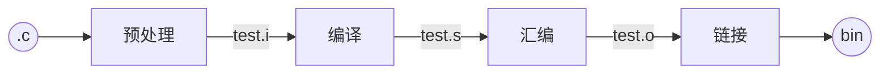

# 一、预处理

预处理相当于根据预处理命令组装成新的源码文件，常以***i***最为扩展名

主要过程：

1、处理预编译指令，例如#define，#if、#ifnde、#ifdefine等

2、将#include包含文件插入到该预编译指令的位置

3、删除所有的注析//、/**/等

命令：

```shell
gcc -E test.c -o test.i
cpp -E test.c >> test.i
```


# 二、编译

将得到的i文件翻译成汇编代码， 通常以s作为扩展名

命令：

```shell
gcc -S test.i -o test.s
gcc -S test.c -o test.s
```

## 2.1、词法分析

扫描字节序并产生记号。词法分析产生的记号一般可以分为如下几类：关键字、标识符、字面量（包含数字、字符串等）和特殊符号（如加号、等号）。


## 2.2、语法分析

语法分析器（Grammar Parser）将对由扫描器产生的记号进行语法分析，从而产生语法树（Syntax Tree)。由语法分析器生产的语法树就是以表达式（Expression）为节点的树。


## 2.3、语义分析

语法分析仅仅是完成了对表达式的语法层面的分析，但是它并不了解这个语句是否真的有意义。编译器所能分析的语义是静态语义（Static Semantic），所谓静态语义是指在编译期可以确定的语义，与之对应的动态语义（Dynamic Semantic）就是只有在运行期才能确定的语义。静态语义通常包括声明和类型的匹配，类型的转换


# 三、汇编

将汇编文件翻译成机器指令，并打包成可重定位目标程序的o文件。 该文件是二进制文件，字节编码是机器指令。


# 四、链接

将引用的其他o文件并入到我们程序所在的o文件中，处理得到最终的可执行文件。
